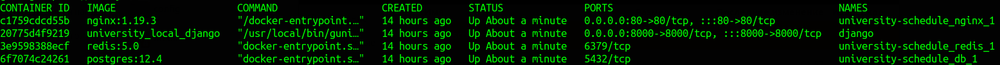
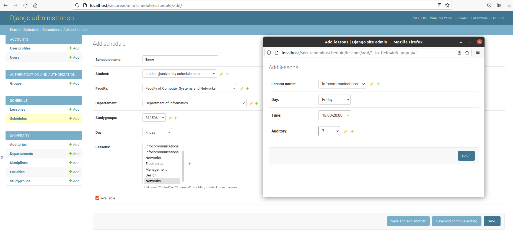
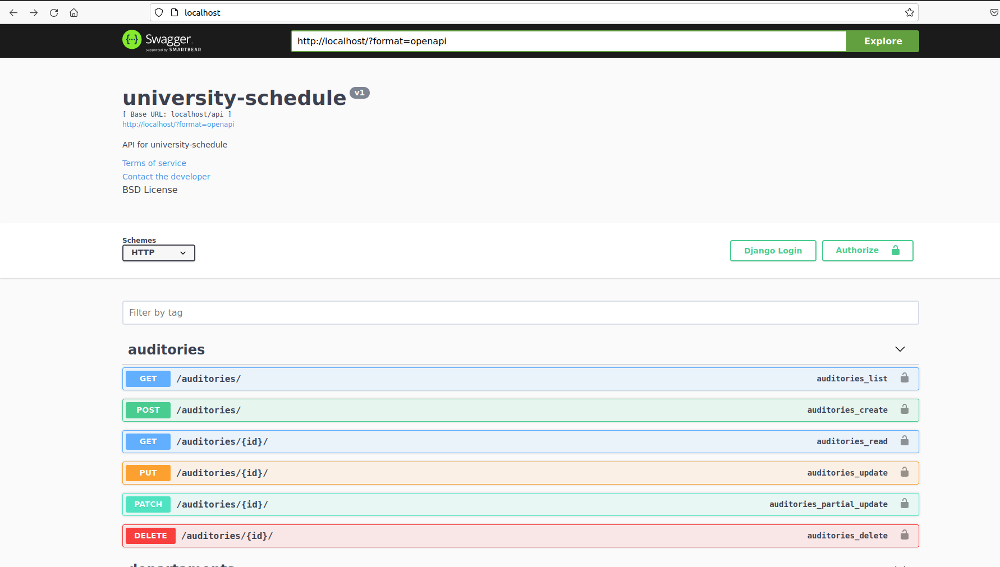
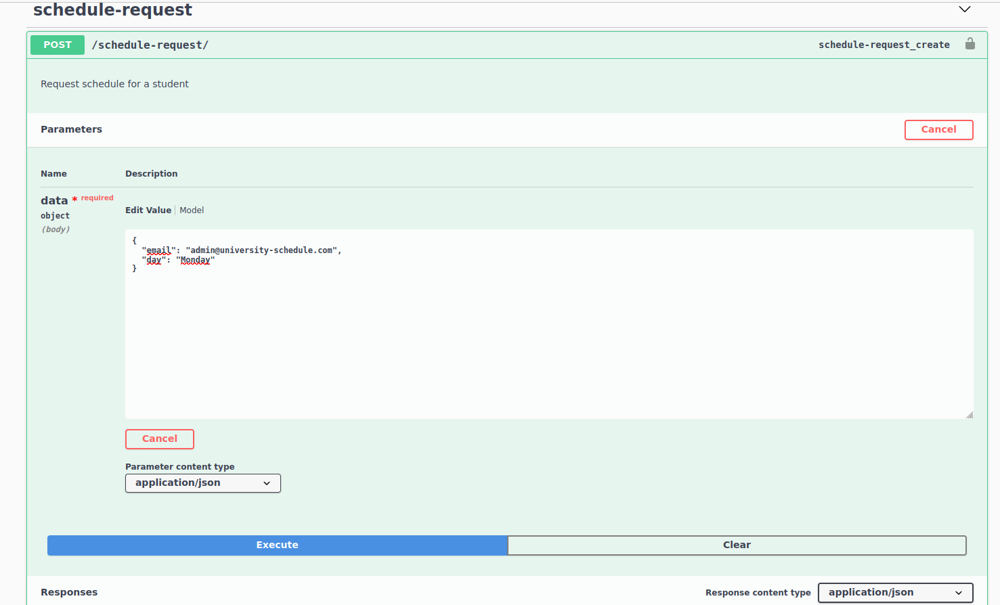
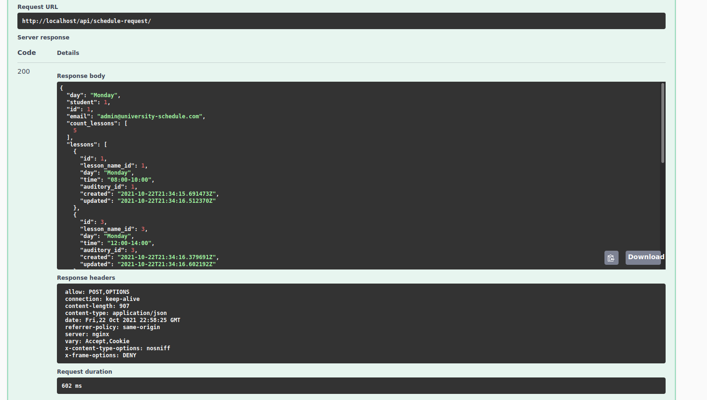
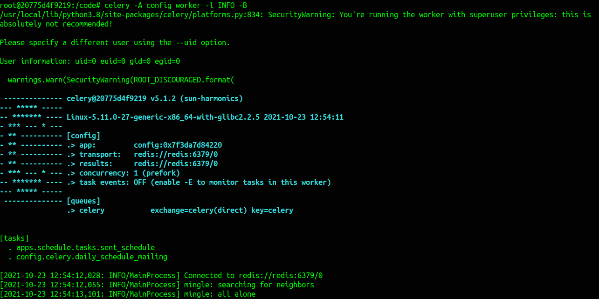
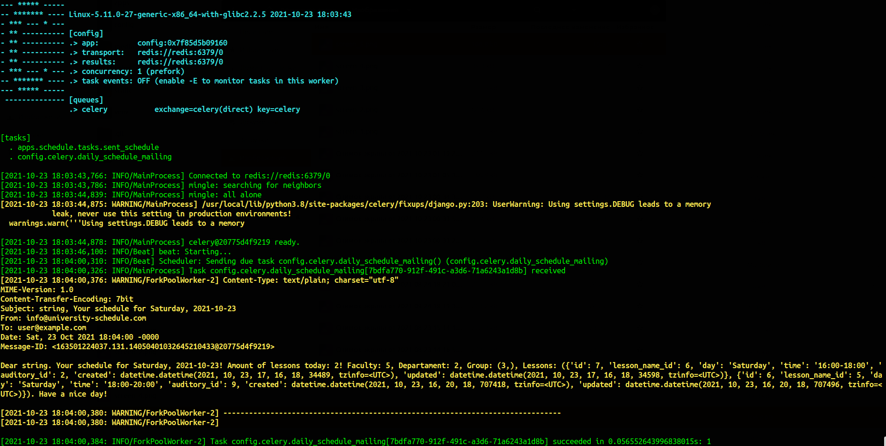

# university-schedule API

#### django 3.2.8
#### drf-yasg 1.20.0
#### djangorestframework 3.12.4
#### pillow 8.4.0

# INSTALL (for linux)

1) Install docker, docker-compose:
2) Git clone:

```https://github.com/ilyukevich/university-schedule.git```

3) Execute from the project folder:

```sudo docker-compose up -d --build```

4) Enter in container django:

```sudo docker exec -it django bash```

- Preparation of migrations:

```python manage.py makemigrations```

- Applying migrations:

```python manage.py migrate```

- Load data into database. Creating groups and permissions for them, creating superuser, creating users and selecting groups for them:

```python manage.py load_data_accounts```

- Load data into database for app University into database (Faculties, Departaments, StudyGroups, Auditories, Disciplines):

```python manage.py load_data_university```

- Load data into database for app Schedule into database (Lessons, Schedule):

```python manage.py load_data_schedule```

- Collection of all statics:

```python manage.py collectstatic```

- Start celery:

```celery -A config worker -l INFO -B```

### Info:
Start all containers. Use the key -d to run containers in the background:

```sudo docker-compose up```

Stop all containers:

```sudo docker-compose stop```

### Celery:
- periodic_task. Every day at 6:00 AM, emails are sent to those students who have lessons that day.
- task. Sent email with schedule for user after request: http://localhost/api/schedule-request/

### Authorization (login: password):
```role superuser - [admin@university-schedule.com: admin]```

```role administrator - [administrator@university-schedule.com: administrator]```

```role specialist - [specialist@university-schedule.com: specialist]```

```role lecturer - [lecturer@university-schedule.com: lecturer]```

```role student - [student@university-schedule.com: student]```

```role other - [other@university-schedule.com: other]```

### Access to the project:
```http://localhost/ ```

```http://localhost/secureadmin/```

### Get student schedule (set email and day):

```http://localhost/api/schedule-request/```

#### email: admin@university-schedule.com
#### day: Monday

### Swagger:
```http://localhost/swagger/```

### Redoc:
```http://localhost/redoc/```

### DRF:
```http://localhost/api/```

```http://localhost/api/token/``` - token

```http://localhost/api/token/refresh/``` - refresh token

```http://localhost/api/registrations/``` - registration

```http://localhost/api/login/``` - login

```http://localhost/api/logout/``` - logout

```http://localhost/api/reset-password/``` - reset password

```http://localhost/api/schedule-request/``` - request schedule for a student

```http://localhost/api/users/``` - users

```http://localhost/api/userprofiles/``` - userprofiles

```http://localhost/api/departaments/``` - faculties

```http://localhost/api/departaments/``` - departaments

```http://localhost/api/study-groups/``` - study-groups

```http://localhost/api/auditories/``` - auditories

```http://localhost/api/disciplines/``` - disciplines

```http://localhost/api/lessons/``` - lessons

```http://localhost/api/schedules/``` - schedules

### TESTS:

1) enter in container django:

```sudo docker exec -it django bash```

2) from container django.

- run tests (all tests of the project will be executed):

```python manage.py test apps``` 

- run application tests 'accounts', 'university', 'schedule'. Example:

```python manage.py test apps/accounts```

```python manage.py test apps/university```

```python manage.py test apps/schedule```

- run test report detail (-v [0,1,2,3]). Example:

```python manage.py test -v 1 apps```

```python manage.py test -v 2 apps```

```python manage.py test -v 2 apps/university```

```python manage.py test -v 2 apps/schedule```

```python manage.py test -v 3 apps/accounts```

## screen:








